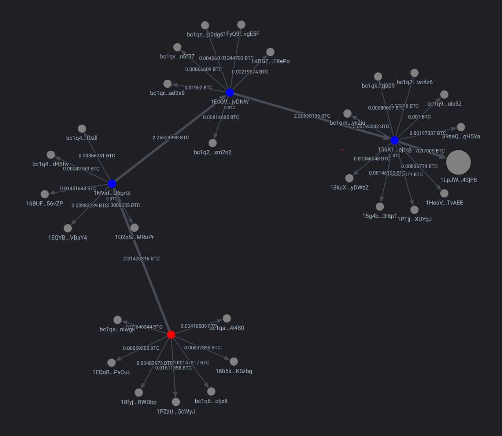

# ChainSight

## Introduction

ChainSight is a blockchain analysis and visualization tool designed to track and analyze the flow of funds across Bitcoin addresses. By leveraging blockchain data, ChainSight provides insights into transaction patterns, relationships between addresses, and the movement of Bitcoin across the network. This project aims to make blockchain analysis more accessible and intuitive for researchers, developers, and enthusiasts.

### Concept

- The graph always begins with a transaction, marked by a red node.
- All other nodes represent individual bitcoin adresses. The initial size of a node is given by the funding value of the transaction pointing to it.
- Directed edges between nodes represent a flow of funds from a source address to a target address. The value of the flow is indicated by the label attached to the edge, as well as by the size of the edge.
- Double clicking on a node loads the next set of transactions from this node as well as the source node's balance. The size of the node is then updated based on its balance.
- Each sub graph is only loading transactions that occurred _after_ the source transaction, based on the source transaction's  block height. This is what allows a user to track the flow of funds and not get confused by earlier unrelated transactions.
- Nodes that have already been loaded are marked in blue.
- ChainSight fetches it's data from the [Mempool API](https://mempool.space/), which has strict rate limitations. If a node does not load (i.e. doesn't turn blue), wait a few seconds and try again.

### How to Use ChainSight
#### Prerequisites
- Ensure you have Node.js and npm installed.

#### Running the Project

- Navigate to `frontend`.
- Install dependencies using `npm install`.
- Start the frontend development server using `npm start`.
- Open your browser and navigate to the frontend URL (usually `http://localhost:3000`).

#### Exploring Transactions
1. Enter a Bitcoin transaction ID in the input field on the homepage.
2. Click "Go!" to load the transaction and visualize its details.
3. Interact with the graph by double-clicking on a node. This will load a new batch of outgoing transactions from this address.

## Future Enhancements
- **Advanced Filtering**: Add options to filter transactions by value, time, or address type.
- **Graph Pruning**: Graphs can become quite large and slow. Add options to prune the graph.
    - **Unvisited Nodes**: Prune unvisited nodes from early addresses.
    - **Selection-based**: Prune nodes based on user selection.
- **Customizable Graph Views**: Allow users to toggle between different graph representations (e.g., value-based vs. urgency-based).
    - **Value-based**: Edge sizes correspond to the amount of a transaction between nodes. Larger transactions lead to larger edges.
    - **Urgency-based**: Edge sizes correspond to the time difference between the source and the target transaction. A transaction that happened sooner than another one will have a larger edge.
- **Incoming vs Outgoing Transactions**:
    - **Outgoing**: Starting with a transaction, visualize the flow of outgoing transactions for each destination address. This is useful to analyze where funds have been flowing to.
    - **Incoming**: Starting with a transaction, visualize the flow of incoming transactions for each source address. This is useful to analyze where funds have been coming from.
- **Customizable Backend**: Allow different backend options.
    - Custom Mempool instance
    - Custom Electrum instance
    - Custom backend connected to Electrum or Bitcoin Daemon.
